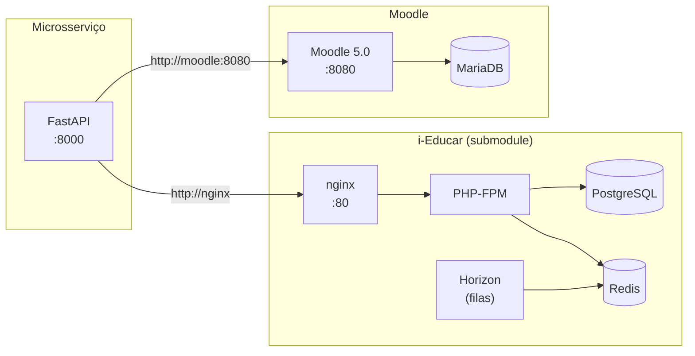

# i-Educar ↔ Moodle Integration

Microsserviço em **FastAPI** que integra dois monólitos educacionais de código aberto: o
[i-Educar](https://github.com/portabilis/i-educar) (gestão escolar) e o
[Moodle](https://moodle.org/) (ambiente virtual de aprendizagem).

Todo o ambiente sobe com um único `docker compose`, já com os dois sistemas e a API
conectados na mesma rede.

## Arquitetura



| Serviço   | Imagem / origem                          | Porta no host |
|-----------|------------------------------------------|---------------|
| API       | `Dockerfile` deste repositório (Python 3.14) | `8000`    |
| i-Educar  | submodule `i-educar` (tag `2.11.0`)      | `80` / `443`  |
| Moodle    | `bitnamilegacy/moodle:5.0.2`             | `8080` / `8443` |
| MariaDB   | `bitnamilegacy/mariadb:11.8.3`           | —             |
| PostgreSQL / Redis | definidos pelo compose do i-Educar | `5432` / `6379` |

## Pré-requisitos

- [Docker](https://docs.docker.com/get-docker/) com Docker Compose v2.20+ (usa `include`)
- [Git](https://git-scm.com/)
- [uv](https://docs.astral.sh/uv/) (apenas para desenvolver a API fora do container)

## Como executar

**1. Clone com o submodule**

```bash
git clone --recurse-submodules https://github.com/vargasnico/ieducar-moodle-integration.git
cd ieducar-moodle-integration
```

Se já clonou sem o submodule: `git submodule update --init`.

**2. Crie o `.env` do i-Educar**

```bash
cp i-educar/.env.example i-educar/.env
```

**3. Suba os containers**

```bash
docker compose up -d --build
```

**4. Instale o i-Educar (apenas na primeira vez)**

```bash
docker compose exec -u root php sh -c "find bootstrap/cache storage -type d -exec chmod 777 {} +"
docker compose exec php composer new-install
docker compose exec php php artisan db:seed
```

> O primeiro comando evita erros de permissão em volumes montados no Windows.

A primeira inicialização do Moodle leva alguns minutos; acompanhe com
`docker compose logs -f moodle`.

## Acessos

| Sistema   | URL                              | Credenciais padrão        |
|-----------|----------------------------------|---------------------------|
| API (docs)| http://localhost:8000/docs       | —                         |
| i-Educar  | http://localhost                 | definidas pelo seeder     |
| Moodle    | http://localhost:8080            | `admin` / `admin123`      |

Verificação rápida: `curl http://localhost:8000/health`

## Configuração

As variáveis abaixo podem ser definidas em um `.env` na raiz do projeto:

| Variável                     | Padrão               |
|------------------------------|----------------------|
| `API_PORT`                   | `8000`               |
| `MOODLE_HTTP_PORT`           | `8080`               |
| `MOODLE_HTTPS_PORT`          | `8443`               |
| `MOODLE_USERNAME`            | `admin`              |
| `MOODLE_PASSWORD`            | `admin123`           |
| `MOODLE_EMAIL`               | `admin@example.com`  |
| `MOODLE_SITE_NAME`           | `Moodle`             |
| `MOODLE_DATABASE_USER`       | `bn_moodle`          |
| `MOODLE_DATABASE_PASSWORD`   | `moodle`             |
| `MOODLE_DATABASE_NAME`       | `bitnami_moodle`     |

As configurações do i-Educar (portas, banco, etc.) ficam em `i-educar/.env`.

## Desenvolvimento da API

Com hot reload dentro do Docker:

```bash
docker compose watch
```

Ou localmente, fora do container:

```bash
uv sync
uv run fastapi dev src/app/main.py
```

Lint e checagem de tipos:

```bash
uv run ruff check .
uv run ty check
```

## Estrutura

```
.
├── src/app/              # Código do microsserviço FastAPI
├── i-educar/             # Submodule do i-Educar (tag 2.11.0)
├── Dockerfile            # Imagem da API
├── docker-compose.yml    # Orquestração: API + i-Educar + Moodle
└── ieducar.override.yml  # Ajustes sobre o compose do i-Educar
```

## Solução de problemas

- **Horizon em restart loop (`env: can't execute 'php'`)** — causado por quebras de linha
  CRLF no checkout do Windows. Já tratado pelo `ieducar.override.yml`; para evitar o
  problema em outros scripts, configure o submodule com
  `git -C i-educar config core.autocrlf false` antes do checkout.
- **Portas em uso** — altere `DOCKER_NGINX_PORT`, `DOCKER_POSTGRES_PORT` etc. em
  `i-educar/.env`, ou as variáveis da tabela acima.

## Autores

- Francisco Rotilli — [francisco.r@edu.pucrs.br](mailto:francisco.r@edu.pucrs.br)
- Nícolas Durgante Vargas — [nicolas.v02@edu.pucrs.br](mailto:nicolas.v02@edu.pucrs.br)
